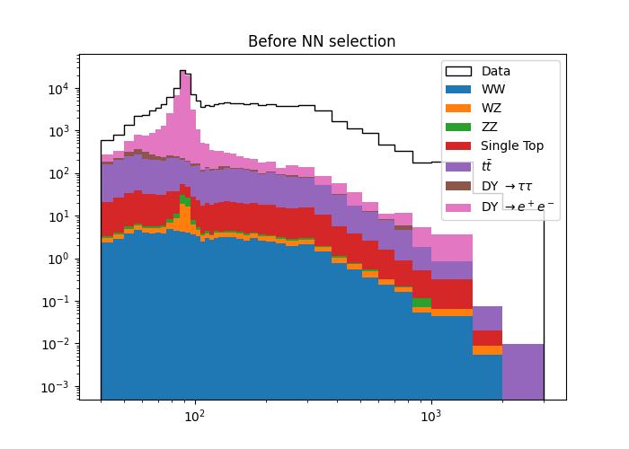
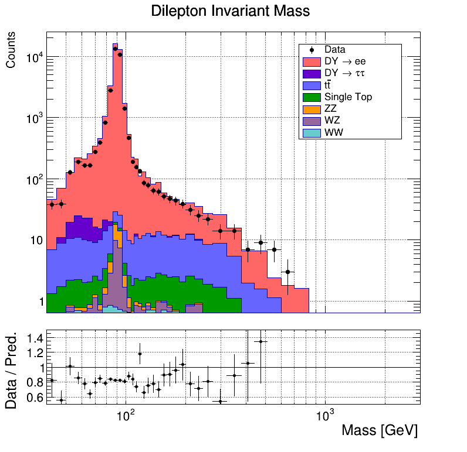
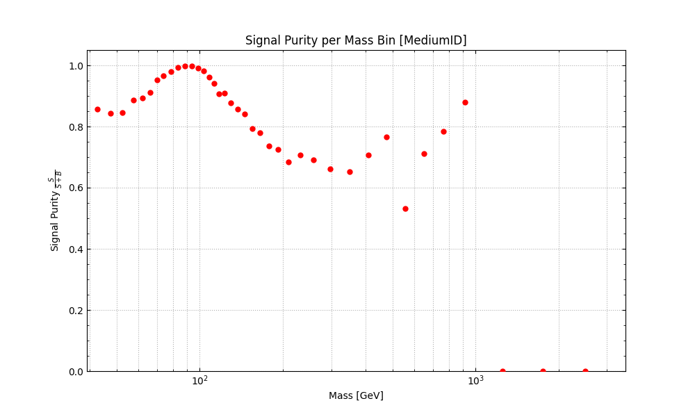
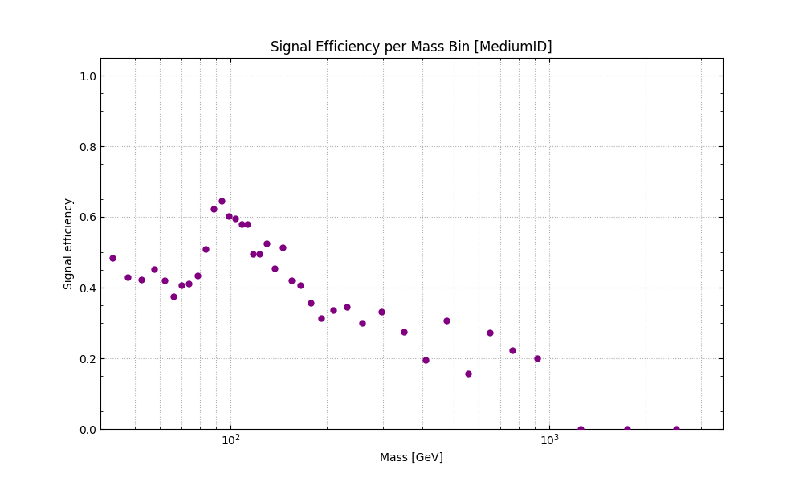
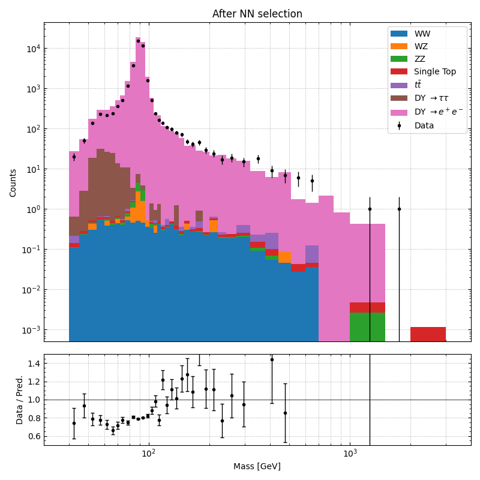
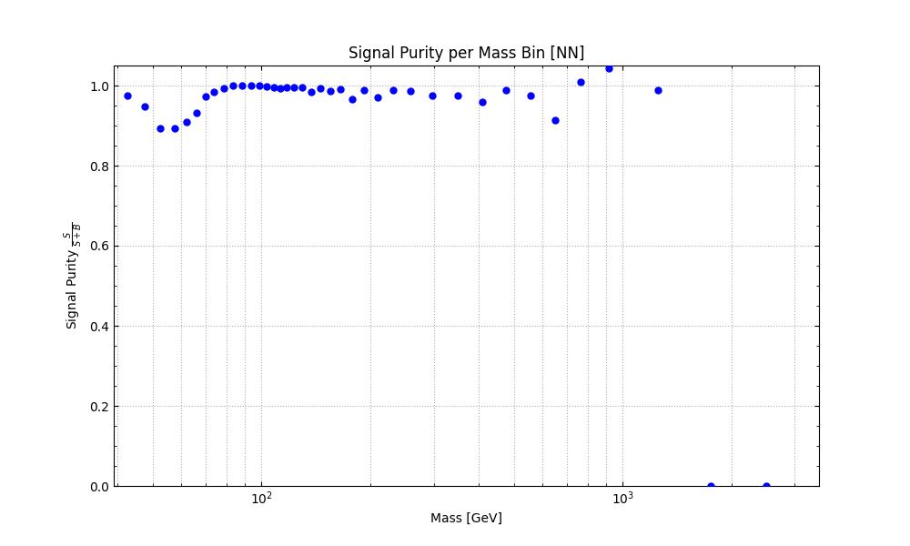
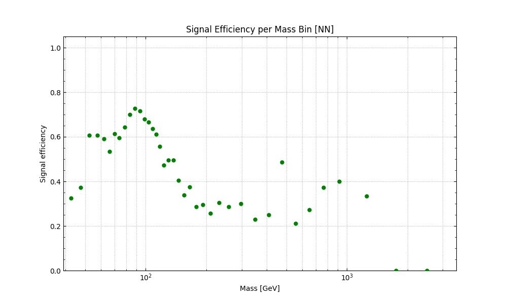

# Project report
            
## 1. Dataset and Simulation Samples

This analysis uses proton–proton collision data collected by the CMS experiment at a center-of-mass energy of 13 TeV during the 2016 LHC Run (Run II, Ultra Legacy dataset). The data correspond to the DoubleEG trigger stream, stored in the NANOAOD format (NanoAODv9).

### **The real data sample:**

- 2016 Data (Run H, DoubleEG dataset)
CMS Run II Ultra Legacy (2016H), reconstructed in MiniAODv2 and processed to NanoAODv9 format. Dataset: [CMS Open Data record 30554](https://opendata.cern.ch/record/30554)

----
### **Monet Carlo simulation samples**

**Signal (Drell-Yan)**

- DYJetsToLL (M-50)
    - Dataset: [CMS Open Data record 35669](https://opendata.cern.ch/record/35669)
- DYJetsToLL (M-10 to 50)
    - Dataset: [CMS Open Data record 35631](https://opendata.cern.ch/record/35631)

**Background processes**

The following Standard Model background processes are included:

- **Top quark pair production ($t\overline{t}$)**
    - Dataset: [CMS Open Data record 67731](https://opendata.cern.ch/record/67731)
- **Single top production**
    - tW channel (top + W)
        - Dataset: [CMS Open Data record 64895](https://opendata.cern.ch/record/64895)
    - t{W_bar} (anti-top W)
        - Dataset: [CMS Open Data record 64839](https://opendata.cern.ch/record/64839)
    - t-channel single top
        - Dataset: [CMS Open Data record 64793](https://opendata.cern.ch/record/64793)
    - t-channel single anti-top
        - Dataset: [CMS Open Data record 64693](https://opendata.cern.ch/record/64693)
- **Diboson processes**
    - WW
        - Dataset: [CMS Open Data record 72696](https://opendata.cern.ch/record/72696)
    - WZ
        - Dataset: [CMS Open Data record 72754](https://opendata.cern.ch/record/72754)
    - ZZ
        - Dataset: [CMS Open Data record 75593](https://opendata.cern.ch/record/75593)
- **Drell-Yan $\rightarrow$ $\tau \tau$**
    - Events where Z/$\gamma^*$ $\rightarrow$ $\tau^+\tau^-$ are treated as a separate background. These are separated using LHE-level tau identification (PDG ID = ±15).

## 2. Event Selection and Feature Construction (Data Preparation)
### Feature Engineering and Event Selection
In this work, a physics-driven feature preparation pipeline was implemented using ROOT-based analysis of NanoAOD data. The goal was to construct fixed-size, machine-learning-ready event representations for a neural network classifier.

### Event Topology Selection
Events are required to contain at least two electrons, which are then sorted by transverse momentum and reduced to a fixed two-electron system (leading and subleading electrons). This defines a dilepton event topology, consistent with processes such as Drell–Yan (DY $\rightarrow$ $e^+e^-$).

### Kinematic and Acceptance Cuts
A set of standard CMS-inspired selection criteria is applied:
- Leading electron: $p_T$ > 28 GeV
- Subleading electron: $p_T$ > 20 GeV
- Pseudorapidity: $|\eta|$ < 2.5
- ECAL barrel–endcap transition region removed:
    1.4442 < $|\eta|$ < 1.566

These cuts ensure detector acceptance, trigger compatibility, and improved object quality.

### Physics-Inspired Feature Set
Each event is transformed into a fixed-length feature vector consisting of:

#### Electron Features (2 objects per event)
- $p_T$, $\eta$, $\phi$
- Shower shape: `sieie`, `hoe`
- Impact parameters: `dxy`, `dz`
- Isolation variables: `miniPFRelIso_all`, `dr03TkSumPt`
- Energy consistency: `eInvMinusPInv`, `scEtOverPt`

#### Jet Features (up to 4 jets)
- $p_T$, $\eta$, $\phi$
- b-tag discriminator `btagDeepFlavB`
#### Photon Features (up to 2 photons)
- $p_T$, $\eta$, $\phi$
- Shower shape: `sieie`, `hoe`
- Isolation `pfRelIso03_all`
Photons are matched to electrons using a minimum $\Delta R$ criterion to capture nearby radiation or misidentified objects.

#### Missing Transverse Energy (MET)
- `MET_phi`
- `MET_significance`
- `MET_sumEt`

## 3. Neural Network Architecture and Training
A fully connected feed-forward neural network was used to perform binary classification between signal (Drell–Yan) and Standard Model background processes.

### Input Features
The model is trained on a fixed-length feature vector constructed from:
- Electron kinematics and identification variables
- Jet activity (up to 4 jets)
- Photon activity (up to 2 photons)
- Missing transverse energy (MET) variables

Exact feature names were mentioned above. All input features are standardized using StandardScaler to ensure zero mean and unit variance, improving training stability.

### Model Architecture
The neural network is implemented using TensorFlow/Keras and has the following structure:
- Input layer: number of physics features
- Dense layer: 48 neurons
    - Batch Normalization
    - LeakyReLU activation
    - Dropout (0.2)
    - L2 regularization (1e-4)
- Dense layer: 24 neurons
    - Batch Normalization
    - LeakyReLU activation
    - Dropout (0.2)
- Dense layer: 12 neurons
    - LeakyReLU activation
- Output layer:
    - 1 neuron with sigmoid activation
    - Outputs probability of being signal (DY) vs background

### Training Setup
The model is trained as a binary classifier using:
- Loss function: binary cross-entropy
- Optimizer: Adam (learning rate = 5 $\times$ 10$^{-4}$)
- Metrics: accuracy and ROC-AUC
- Batch size: 128
- Epochs: 30
- Validation split: 20% of training data

### Sample Weighting Strategy
To improve physical realism and reduce bias in the training distribution, a custom sample weighting strategy is applied.

#### 1. Signal reweighting (mass flattening)
Signal events are reweighted based on the invariant mass distribution of the reconstructed Z boson system. The mass spectrum is binned, and weights are assigned as:
- Events in bin i are weighted by:

    $w = \frac{1}{\sqrt{N_{\text{bin}}}}$

where:
- $N_{bin}$ = number of events in mass bin.

This flattens the mass distribution and prevents the model from being dominated by high-statistics regions.

#### 2. Background treatment and QCD enhancement
All background processes are included in training, with special treatment for QCD:
- QCD samples (qcd1–qcd8) are explicitly upweighted (×10)
- This improves sensitivity to rare but important QCD-like backgrounds
- Ensures the classifier does not underestimate QCD contamination

### Dataset Splitting and Evaluation Strategy
The dataset is randomly split into training (80%) and testing (20%) subsets. Additionally, independent Monte Carlo samples not used in training are used for evaluation of model performance, ensuring unbiased validation and preventing data leakage.
### Output
The trained model outputs a probability score:
- Close to 1 → signal-like event (DY)
- Close to 0 → background-like event
The final model is saved for further physics analysis and inference studies.

## Results and Discussion
To evaluate the performance of the neural network classifier, its results are compared against a traditional cut-based selection implemented in C++. The comparison is performed using two key physics performance metrics:
- **Efficiency per bin:** 
    
    Efficiency is defined as the fraction of true signal events that pass a given selection:
    
    $Efficiency = \frac{N_{signal, \ selected}}{N_{signal, \ total}}$ 
​	

    It measures how well the selection retains genuine signal events. High efficiency means the method does not strongly reject true signal, preserving statistics for further analysis.

- **Purity per bin:** 

    Purity is defined as the fraction of selected events that are true signal:
    
    $Purity = \frac{N_{signal, \ selected}}{N_{signal, \ selected} \ + \  N_{background, \ selected}}$ 
    
    It measures how clean the selected sample is in terms of signal content. High purity means low background contamination.

#### 4.1 Baseline: Pre-Selection (Before Classification)
Before applying any selection or machine learning model, the dataset shows:

This is reference distribution for both methods.

#### 4.2 Cut-Based Selection (C++ Analysis)
A traditional physics-driven selection is applied using fixed kinematic and object-level cuts implemented in C++. The plot is shown below:

**Event Selection Requirements**

Events are required to satisfy:
- Double-electron trigger
    - `HLT_Ele23_Ele12_CaloIdL_TrackIdL_IsoVL_DZ`
- At least two reconstructed electrons
- Electron identification
    - Medium cut-based electron ID (cutBased $\geq$ 3)
- Isolation requirement
    - Relative isolation: `pfRelIso03_all < 0.15`
- Opposite-sign electron pair
    - Selected electrons must satisfy opposite electric charge
- Transverse momentum requirements
    - Leading electron: $p_T$ > 28GeV
    - Subleading electron: $p_T$ > 20GeV
- Detector acceptance
    - $|\eta|$ < 2.5
- ECAL transition region veto
    - Events are rejected if either electron lies in 1.4442 < $|\eta|$ < 1.566

to avoid reduced detector response in the barrel–endcap transition region.

Results:

#### 4.3 Neural Network Classification Results
The neural network classifier significantly improves event separation. The plot is shown below:

Results:

Key observations:
- Clear improvement in signal-to-background discrimination
- Higher purity across most invariant mass bins compared to cut-based selection
- Higher efficiency than when using cut-based selection: less signal is dropped out.

#### 4.4 Efficiency and Purity Comparison
The comparison between the two methods shows:
- Efficiency per bin:
    - Neural network maintains higher signal efficiency 
    - Cut-based selection shows sharper drops in certain regions due to hard thresholds
- Purity per bin:
    - Neural network achieves consistently higher and uniform purity across most bins
    - Especially improved separation in regions with high background overlap (low and intermediate mass ranges)

Overall, the neural network provides a more optimal balance between efficiency and purity.