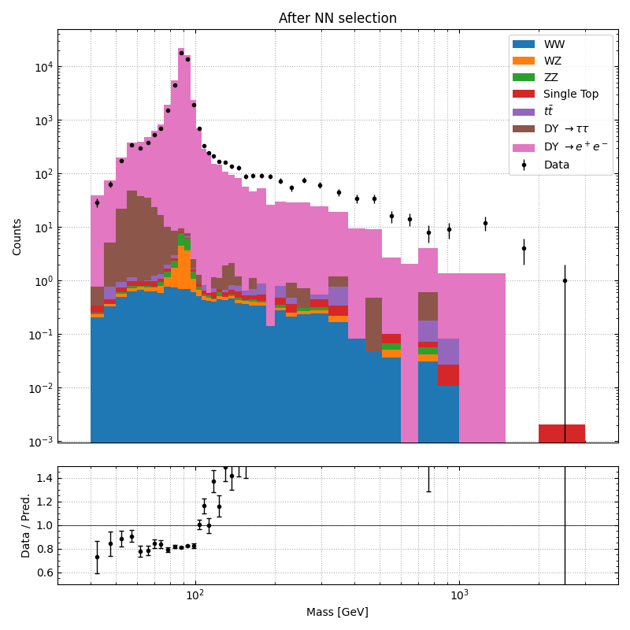
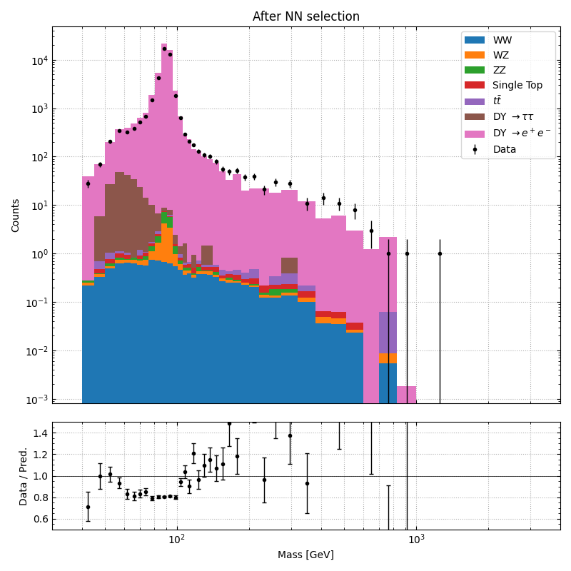
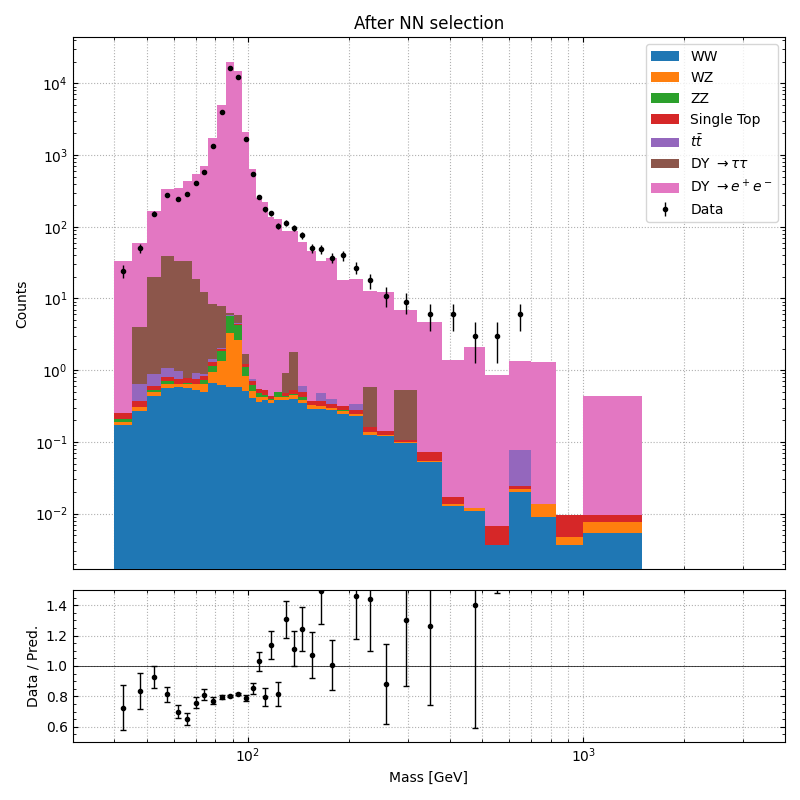
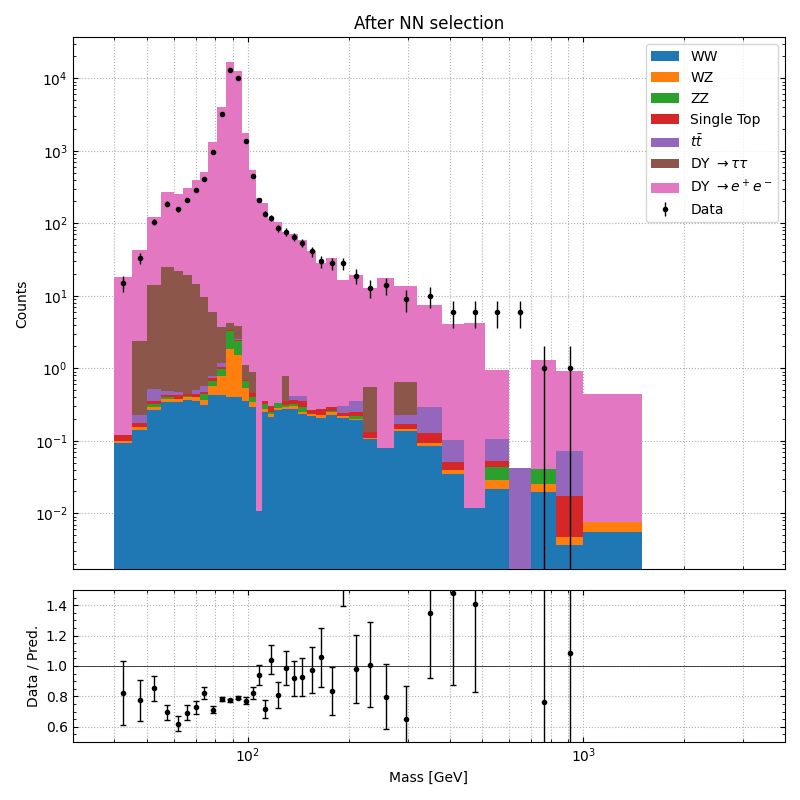
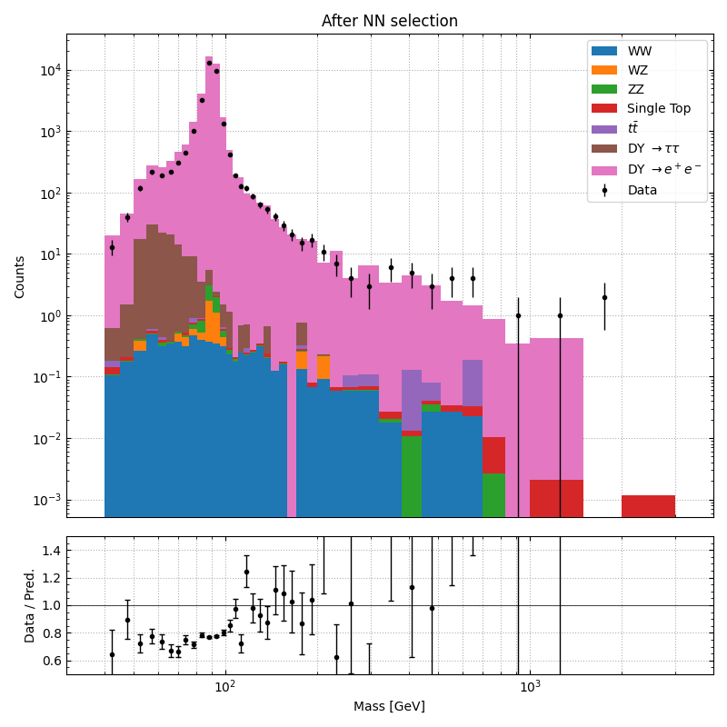

# Results

### 1. Initial plot before applying NN

### 2. Plots after applying NN

## Methods used:
### 1. Mass flattening for signal data

For each bin, the number of signal events was counted:

$
N_{\text{bin}}
$

and the training weight for each signal event was assigned as:

$
w = \frac{1}{\sqrt{N_{\text{bin}}}}
$

where:

- $w$ = event training weight
- $N_{\text{bin}}$ = number of signal events in the corresponding invariant mass bin

### 2. No manipulations with kinematic variables

### 3. Additional weights applied for QCD background

QCD events with two reconstructed electrons are rare and are often caused by fake electrons originating from jets, photon conversions, or detector effects rather than genuine prompt electrons.

Because these events are both rare and important for background rejection, additional training weights were applied to all QCD samples to make the neural network pay more attention to them during training.

For all QCD samples (`qcd1`–`qcd8`), the sample weights were multiplied by a constant factor:
$
w_{\text{QCD}} = 10
$

### 4. Old NN, no photon feature inputs

## Methods used:
### 1. Mass flattening for signal data

For each bin, the number of signal events was counted:

$
N_{\text{bin}}
$

and the training weight for each signal event was assigned as:

$
w = \frac{1}{\sqrt{N_{\text{bin}}}}
$

where:

- $w$ = event training weight
- $N_{\text{bin}}$ = number of signal events in the corresponding invariant mass bin

### 2. Manipulations with kinematic variables

Instead of using the raw transverse momentum values directly, the ratio between the leading and subleading electron transverse momenta was constructed:

$
R_{p_T} = \frac{p_{T,1}}{p_{T,2}}
$

and its logarithm was used as the training input:

$
\log\left(\frac{p_{T,1}}{p_{T,2}}\right)
$

where:

- $p_{T,1}$ = transverse momentum of the leading electron
- $p_{T,2}$ = transverse momentum of the subleading electron

### 3. Additional weights applied for QCD background

QCD events with two reconstructed electrons are rare and are often caused by fake electrons originating from jets, photon conversions, or detector effects rather than genuine prompt electrons.

Because these events are both rare and important for background rejection, additional training weights were applied to all QCD samples to make the neural network pay more attention to them during training.

For all QCD samples (`qcd1`–`qcd8`), the sample weights were multiplied by a constant factor:
$
w_{\text{QCD}} = 10
$

### 4. Old NN, no photon feature inputs

### 1. Mass flattening for signal data

For each bin, the number of signal events was counted:

$
N_{\text{bin}}
$

and the training weight for each signal event was assigned as:

$
w = \frac{1}{\sqrt{N_{\text{bin}}}}
$

where:

- $w$ = event training weight
- $N_{\text{bin}}$ = number of signal events in the corresponding invariant mass bin

### 2. Manipulations with kinematic variables

Instead of using the raw transverse momentum values directly, the ratio between the leading and subleading electron transverse momenta was constructed:

$
R_{p_T} = \frac{p_{T,1}}{p_{T,2}}
$

and its logarithm was used as the training input:

$
\log\left(\frac{p_{T,1}}{p_{T,2}}\right)
$

where:

- $p_{T,1}$ = transverse momentum of the leading electron
- $p_{T,2}$ = transverse momentum of the subleading electron

### 3. Additional weights applied for QCD background

QCD events with two reconstructed electrons are rare and are often caused by fake electrons originating from jets, photon conversions, or detector effects rather than genuine prompt electrons.

Because these events are both rare and important for background rejection, additional training weights were applied to all QCD samples to make the neural network pay more attention to them during training.

For all QCD samples (`qcd1`–`qcd8`), the sample weights were multiplied by a constant factor:
$
w_{\text{QCD}} = 20
$

### 4. Model of NN was changed for this plot, previous plots uses older NN model.

Changed number of neurons in each layer, added dropout function. In addition photon features were added into this new NN, previously used NN was not trained with Photon feature inputs.

This is same as third plot, but here for all QCD samples (`qcd1`–`qcd8`), the sample weights were multiplied by a constant factor:
$
w_{\text{QCD}} = 15
$

This is same as fourth plot, but here for all QCD samples (`qcd1`–`qcd8`), the sample weights were multiplied by a constant factor:
$
w_{\text{QCD}} = 10
$

Also, now the MC plotted in this data is not the same that was trained for NN.